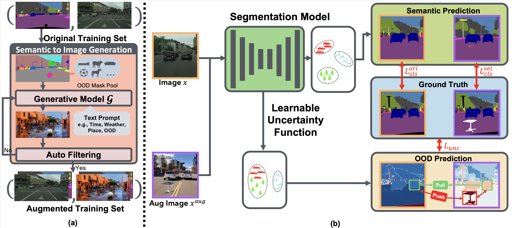

<h1 align="center">Generalize or Detect? Towards Robust Semantic Segmentation Under Multiple Distribution Shifts</h1>

---

<p align="center">
    <a href="https://gaozhitong.github.io"><strong><ins>Zhitong Gao</ins></strong></a>
    ·
    <a href="https://www.bingnanli.com"><strong><ins>Bingnan Li</ins></strong></a>
    ·
    <a href="https://people.epfl.ch/mathieu.salzmann"><strong><ins>Mathieu Salzmann</ins></strong></a>
    ·
    <a href="https://xmhe.bitbucket.io"><strong><ins>Xuming He</ins></strong></a>
</p>


<p align="center"> 
    [<a href="https://arxiv.org/abs/2411.03829#:~:text=Towards%20Robust%20Semantic%20Segmentation%20Under%20Multiple%20Distribution%20Shifts,-Zhitong%20Gao%2C%20Bingnan&text=In%20open%2Dworld%20scenarios%2C%20where,and%20generalize%20to%20new%20domains.">Arxiv</a>]
    [<a href="https://gaozhitong.github.io/posters/poster-cgaug.pdf">Poster</a>]
    [<a href="https://gaozhitong.github.io/slides/slides-cgaug.pdf">Slides</a>]
    [<a href="https://recorder-v3.slideslive.com/?share=95164&s=dd2ba512-5f4c-47ca-8744-4a6a44ad7479">Video</a>]
</p> 

<h4 align="center">NeurIPS 2024 Proceedings</h3>


Figure 1: The overview of the proposed method.

---

### Abstract

> In open-world scenarios, where both novel classes and domains may exist, an ideal segmentation model should detect
> anomaly classes for safety and generalize to new domains. However, existing methods often struggle to distinguish
> between domain-level and semantic-level distribution shifts, leading to poor OOD detection or domain generalization
> performance. In this work, we aim to equip the model to generalize effectively to covariate-shift regions while
> precisely identifying semantic-shift regions. To achieve this, we design a novel generative augmentation method to
> produce coherent images that incorporate both anomaly (or novel) objects and various covariate shifts at both image
> and
> object levels. Furthermore, we introduce a training strategy that recalibrates uncertainty specifically for semantic
> shifts and enhances the feature extractor to align features associated with domain shifts. We validate the
> effectiveness
> of our method across benchmarks featuring both semantic and domain shifts. Our method achieves state-of-the-art
> performance across all benchmarks for both OOD detection and domain generalization.

---

### Environment Setup

```bash
conda env create -f environment.yml 

conda activate MultiShiftSeg
git clone https://github.com/facebookresearch/detectron2.git
pip install -e detectron2
pip install git+https://github.com/cocodataset/panopticapi.git
cd lib/network/mask2former/modeling/pixel_decoder/ops
sh make.sh
```

### Data Preparation
#### 1. Training Dataset
We use Cityscapes for training, which you can download from the [official website](https://www.cityscapes-dataset.com/).
We augment the original dataset with multiple distribution shifts using [ControlNet](https://github.com/lllyasviel/ControlNet). To reproduce the data generation process, please refer to the [Generation Instruction](CGAug/README.md).

You can also directly download our already generated data from [Google Drive](https://drive.google.com/file/d/1PxjH5q-R6kBdVaaC0ssBXwl8Z7JbBWIk/view?usp=share_link)
or [Hugging Face](https://huggingface.co/datasets/Cuttle-fish-my/DTWP_ADE/tree/main). 

#### 2. Evaluation Dataset
Below are the datasets used in our evaluations, along with links for downloading:
* [RoadAnomaly](https://www.epfl.ch/labs/cvlab/data/road-anomaly/) 
* [SMIYC - RoadAnomaly21](https://uni-wuppertal.sciebo.de/s/TVR7VxukVrV7fUH/download)
* [SMIYC - RoadObstacle21](https://uni-wuppertal.sciebo.de/s/wQQq2saipS339QA/download)
* [ACDC-POC](https://download.europe.naverlabs.com/POC_Datasets/data.zip) (you may need to convert .npz files into .png manually.)
* [MUAD](https://muad-dataset.github.io/) We use the challenge subset.

Alternatively, for ease of use and standardization, you may prefer to download a preprocessed version of the datasets from [Synboost](https://github.com/giandbt/synboost), 
which includes RoadAnomaly, FS Static, and FS Lost&Found:
* [Preprocessed Datasets](http://robotics.ethz.ch/~asl-datasets/Dissimilarity/data_processed.tar)

After downloading the dataset(s), you will need to configure the data directory in [lib/dataset/](lib/dataset/) to align with the structure of the downloaded files.
The expected data structure for these datasets in our code is as follows:

```
datasets
├── cityscapes
│   ├── leftImg8bit
│   └── gtFine  
├── multishift_cityscapes (our augmented dataset)
│   ├── leftImg8bit
│   └── gtFine                                         
├── road_anomaly
│   ├── original
│   └── labels
├── dataset_AnomalyTrack            
│   ├── images
│   └── labels_masks
├── dataset_ObstacleTrack           
│   ├── images
│   └── labels_masks
├── MUAD_challenge                  
│   └── test_sets
│       └── test_OOD
│           ├── leftImg8bit
│           └── leftLabel
├── acdc_poc                        
│   ├── gt_trainval
│   └── rgb_anon_trainvaltest
```

### Training
To train the models, use the following commands:
```bash
# DeepLab v3+
python train_deeplab.py --cfg 'exp/DeepLab.yaml' --id <YOUR_EXP_ID> --weight_path <YOUR_PATH_TO>/DeepLabV3+_WideResNet38_baseline.pth
```
We follow previous works such as [RPL](https://github.com/yyliu01/RPL) initialize DeepLab v3+ with a pretrained closed-world model checkpoint from [NVIDIA's semantic segmetation repository](https://github.com/NVIDIA/semantic-segmentation/tree/sdcnet). You can the pretrained checkpoint from [this Google Drive link](https://drive.google.com/file/d/1P4kPaMY-SmQ3yPJQTJ7xMGAB_Su-1zTl/view). After downloading, specify the model weight path using the `--weight_path` argument.

```bash
# Mask2Former
python train_m2f.py --cfg 'exp/M2F.yaml' --id <YOUR_EXP_ID> --weight_path <YOUR_PATH_TO>/bt-f-xl.pth
```
For the Mask2Former model, we use the first-stage pretrained checkpoint provided by the [Mask2Anomaly](https://github.com/shyam671/ Mask2Anomaly-Unmasking-Anomalies-in-Road-Scene-Segmentation?tab=readme-ov-file) project. You can download this checkpoint from [this Google Drive link](https://drive.google.com/file/d/1UVms08chnBkZta_cNumjiei6GByyM9VN/view?usp=share_link) and then provide its path via the `--weight_path` argument.

### Evaluation

After training the model, you can perform inference and evaluate out-of-distribution detection performance using the following commands:

```bash
python test_deeplab.py --cfg 'exp/DeepLab.yaml' --id  <YOUR_EXP_ID> --weight_path <MODEL_WEIGHT_PATH>
```
or 
```bash
python test_m2f.py --cfg 'exp/M2F.yaml' --id  <YOUR_EXP_ID> --weight_path <MODEL_WEIGHT_PATH>
```
If you wish to evaluate using the provided pretrained models, download the corresponding checkpoints below, and replace <MODEL_WEIGHT_PATH> with the path to the downloaded weights.


### Checkpoint

|             | RoadAnomaly | RoadAnomaly | RoadAnomaly | SMIYC-RA21 | SMIYC-RA21 | SMIYC-RO21 | SMIYC-RO21 |                                                                                                 Weights                                                                                                 |
|:-----------:|:-----------:|:-----------:|:-----------:|:----------:|:----------:|:----------:|:----------:|:-------------------------------------------------------------------------------------------------------------------------------------------------------------------------------------------------------:|
|   Method    |     AUC     |     AP      |     FPR     |     AP     |    FPR     |     AP     |    FPR     |                                                                                                                                                                                                         |
| DeepLab v3+ |    96.40    |    74.60    |    16.08    |   88.06    |    8.21    |   90.71    |    0.26    | [Google Drive](https://drive.google.com/file/d/1EB73bf3w0HJQdNcpFp_vOgWpOctYz7Tr/view?usp=share_link) or [Hugging Face](https://huggingface.co/Cuttle-fish-my/MultiShiftSeg/blob/main/DeepLab_best.pth) |
| Mask2Former |    97.94    |    90.17    |    7.54     |   91.92    |    7.94    |   95.29    |    0.07    |   [Google Drive](https://drive.google.com/file/d/1wH0skkEk6DXMVawegwcFLHhc1mA0Z3p1/view?usp=share_link) or [Hugging Face](https://huggingface.co/Cuttle-fish-my/MultiShiftSeg/blob/main/M2F_best.pth)   |

Note: The SMIYC results reported are evaluated on the official online benchmarks. To verify the correctness of the pretrained models locally, you can run inference on the RoadAnomaly dataset. The evaluation scores should closely match those shown in the table.

### BibTeX

```bibtex
@inproceedings{
gao2024generalize,
title={Generalize or Detect? Towards Robust Semantic Segmentation Under Multiple Distribution Shifts},
author={Zhitong Gao and Bingnan Li and Mathieu Salzmann and Xuming He},
booktitle={The Thirty-eighth Annual Conference on Neural Information Processing Systems},
year={2024},
url={https://openreview.net/forum?id=h0rbjHyWoa}
}
```